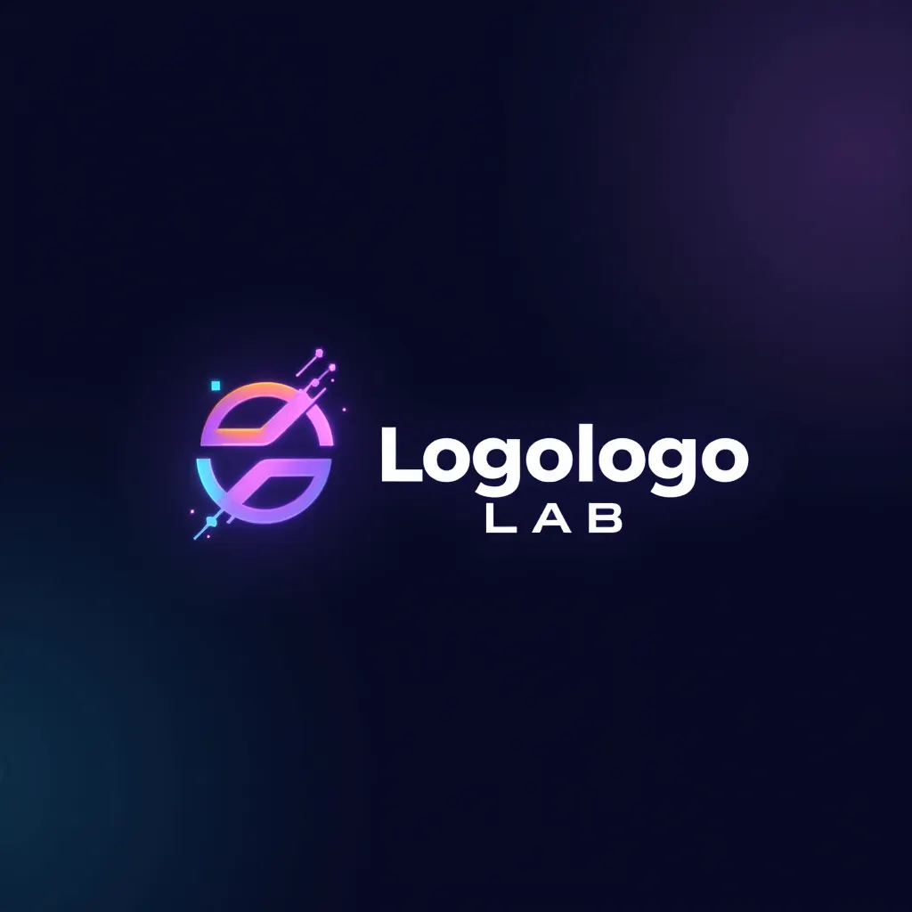
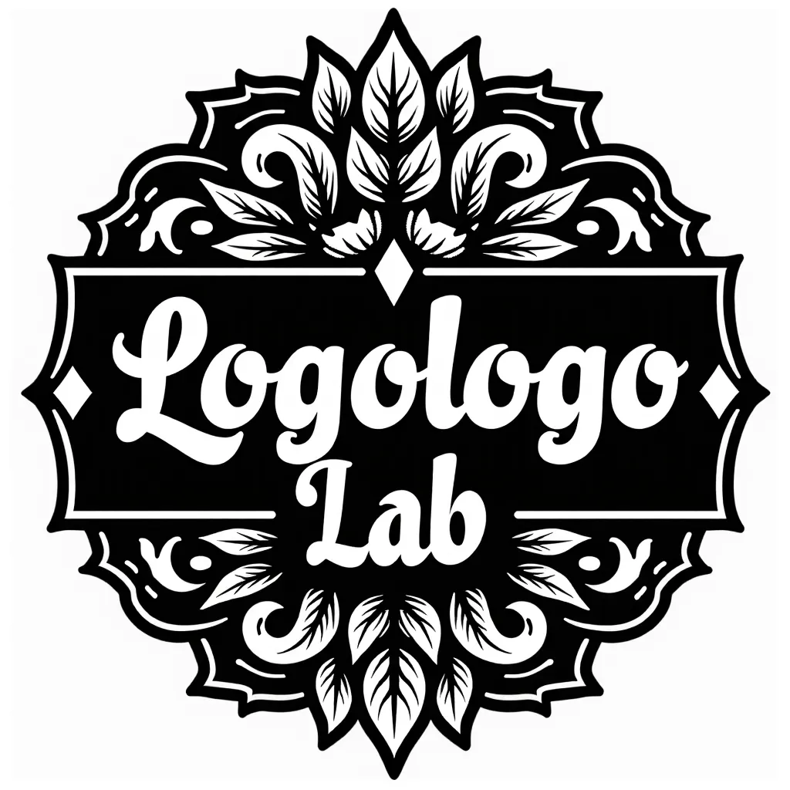

# Generative AI Web Service for Logo Creation & Branding (FLUX + LoRA)

FastAPI-based web API that generates **logo images from text prompts** using **FLUX.1-dev + LoRA**.  
Send a prompt to `/generate-logo` and receive **Base64-encoded PNG** images.

> **Scope**
> - This repo is **inference-only** (no training code or datasets).
> - LoRA weights can be loaded from a **local file** or **Hugging Face**.
> - Built and tested on **RunPod GPU instances (NVIDIA A100/H100, CUDA 12.1)** with **VS Code Remote-SSH**.

---

## 1) Project Structure

```

project/
├── app.py                        # FastAPI server (startup + /generate-logo)
├── model/
│   ├── __init__.py
│   └── inference.py              # FLUX pipeline load + LoRA apply + inference
├── downloaded_lora/
│   └── pytorch_lora_weights.safetensors
├── outputs/                      # optional: save generated images (not required)
├── assets/
│   └── samples/
│      ├── logo1.png             # sample result (add later)
│      └── logo2.png             # sample result (add later)
└── README.md

````

> Current code expects a **local LoRA file** at `downloaded_lora/pytorch_lora_weights.safetensors`.

---

## 2) Environment & Requirements

- **Platform:** RunPod (Linux) on **NVIDIA A100/H100**  
- **CUDA / PyTorch:** CUDA 12.1 wheels  
- **Editor:** **VS Code Remote-SSH**  
- **Core libs:** FastAPI, Uvicorn, Diffusers, Transformers, Accelerate, PyTorch, Safetensors

### Pinned versions used in this project

- PyTorch **2.5.1+cu121** / torchvision **0.20.1+cu121** / torchaudio **2.5.1**
- diffusers **0.35.1**
- transformers **4.45.2**
- accelerate **1.1.1**
- safetensors **0.4.5**
- huggingface_hub (latest) — only needed if you download weights from HF at runtime
- sentencepiece (needed for some tokenizers; safe to include)
- Pillow, numpy

### Install (exact commands)

```bash
# 1) PyTorch CUDA 12.1 wheels (A100/H100)
pip install torch==2.5.1+cu121 torchvision==0.20.1+cu121 torchaudio==2.5.1 \
  --index-url https://download.pytorch.org/whl/cu121

# 2) Diffusers stack
pip install diffusers==0.35.1 transformers==4.45.2 accelerate==1.1.1 safetensors==0.4.5

# 3) Utilities
pip install pillow "numpy>=1.24,<3" sentencepiece

# 4) (Optional) Hugging Face Hub for remote LoRA
pip install huggingface_hub
# If you need private access:
# huggingface-cli login    # <<< Do NOT commit tokens; use environment variables or CI secrets.
````

> **Device note (CUDA)**
> `inference.py` uses `torch_dtype=torch.bfloat16` and `.to("cuda")` — optimal for **A100/H100**.
> If your CUDA build complains about dtype, change to `float16`.

---

## 3) How to Run (RunPod/CUDA + VS Code)

1. Place LoRA at:

   ```
   downloaded_lora/pytorch_lora_weights.safetensors
   ```

2. Launch API:

   ```bash
   uvicorn app:app --host 0.0.0.0 --port 8000
   ```

> First run downloads the base model; loading may take time.

---

## 4) API

### `POST /generate-logo`

**Request (JSON)**

```json
{
  "prompt": "minimal cute fox mascot logo, flat vector, centered, white background",
  "negative_prompt": "photo, 3d, text, watermark, low quality",
  "num_images": 1,
  "height": 1024,
  "width": 1024
}
```

**Response (JSON)**

```json
{
  "images": ["<BASE64_PNG>", "<BASE64_PNG>"]
}
```

**cURL**

```bash
curl -X POST http://localhost:8000/generate-logo \
  -H "Content-Type: application/json" \
  -d '{
    "prompt": "luxury monogram logo, gold foil, black background, geometric, centered",
    "negative_prompt": "photo, 3d, noisy, watermark, low quality",
    "num_images": 1, "height": 1024, "width": 1024
  }' | jq '.images[0]' -r | sed 's/"//g' | base64 --decode > out.png
```

---

## 5) How It Works (Code Overview)

* `app.py`

  * Startup loads FLUX + applies LoRA once.
  * `/generate-logo` → `generate_images(...)` → PIL → Base64 PNG → JSON.

* `model/inference.py`

  * Loads **FLUX.1-dev** → moves to **CUDA** → finds `FluxTransformer2DModel` → loads LoRA `state_dict` (`strict=False`).
  * Default params: `num_inference_steps=100`, `guidance_scale=10`, size from request, `num_images_per_prompt`.

> You can switch to `pipe.load_lora_weights(...)` depending on Diffusers API version.

---

## 6) LoRA Weights

* **Local (default):** `downloaded_lora/pytorch_lora_weights.safetensors`
  Use **Git LFS** or **GitHub Releases** for large files.

* **Hugging Face (optional):** pin a **revision (commit hash)** for reproducibility.

  ```python
  from huggingface_hub import hf_hub_download
  path = hf_hub_download(
    repo_id="team401/logogen-lora",
    filename="pytorch_lora_weights.safetensors",
    revision="xxxxxxxx"
  )
  apply_lora(flux_model, path)
  ```

---

## 7) Prompting Quick Guide

* **Style tokens** (must include user-chosen style):
  `simple`, `minimal`, `retro`, `vintage`, `cute`, `playful`, `luxury`, `tattoo`, `futuristic`, `cartoon`, `watercolor`

* **Logo types**:

  * Image + Text → `icon with text`
  * Text-only → `text-only design`
  * Image-only → `icon only`

* **Defaults**: Steps 28–64, Guidance 3–6, Size 768–1024, Background `white background`,
  Negative: `photo, 3d, text, watermark, low quality, noisy`

* **Style snippets**

  * minimal: `white background, simple black icon, clean lines, minimal logo, modern sans-serif font`
  * vintage: `retro vintage logo, distressed texture, old-school serif font, classic badge design`
  * cute/playful: `cute playful logo, colorful cartoon mascot, rounded sans-serif font, cheerful design`
  * luxury: `luxury_premium_logo_lora`
  * tattoo: `old-school tattoo style, bold black outlines, traditional Americana motifs, intricate linework, vintage tattoo aesthetic`
  * futuristic: `futuristic logo, sleek metallic surfaces, neon glow accents, holographic effects, modern techno font, digital circuit-inspired design`
  * cartoon: `a cartoon-style logo of a cute animal, vector, colorful, minimal design`
  * watercolor: `watercolor, hand-drawn, soft tones, pastel colors, textured brush strokes, natural flow, light ink wash, artistic feel`

> Keep the final prompt under **77 tokens** when possible.

---

## 8) Sample Results

Below are two sample outputs generated by this API + LoRA (examples; not affiliated with any real brand):

<p align="center">
  
  &nbsp;&nbsp;&nbsp;
  
</p>

---

## 9) Notes, Security & Troubleshooting

* **Security:** never commit secrets (e.g., `HUGGINGFACE_HUB_TOKEN`). Use env vars or CI secrets.
* **CUDA OOM:** reduce size/steps/`num_images`.
* **Photographic look:** strengthen vector terms (`flat vector`, `line-art`) + negatives (`photo, 3d`).
* **Dtype issues:** swap `bfloat16` ↔ `float16` depending on your CUDA build.

---

## 10) License & Credits

* **Base model**: `black-forest-labs/FLUX.1-dev` (respect its license/usage terms).
* **LoRA**: trained by our team (open-source distribution allowed; dataset not redistributed).
* **Code license**: Add a `LICENSE` file (e.g., MIT).

**Trademark/Copyright:** Do not generate deceptive or infringing marks. Use responsibly.

````
