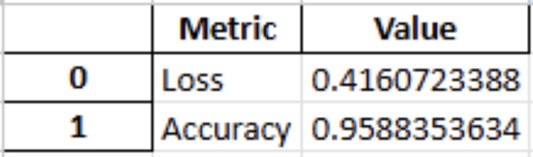
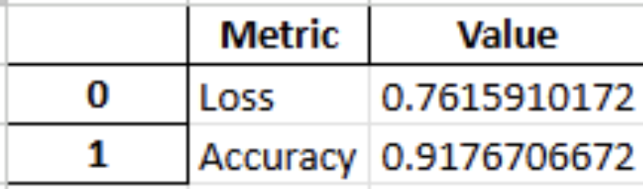
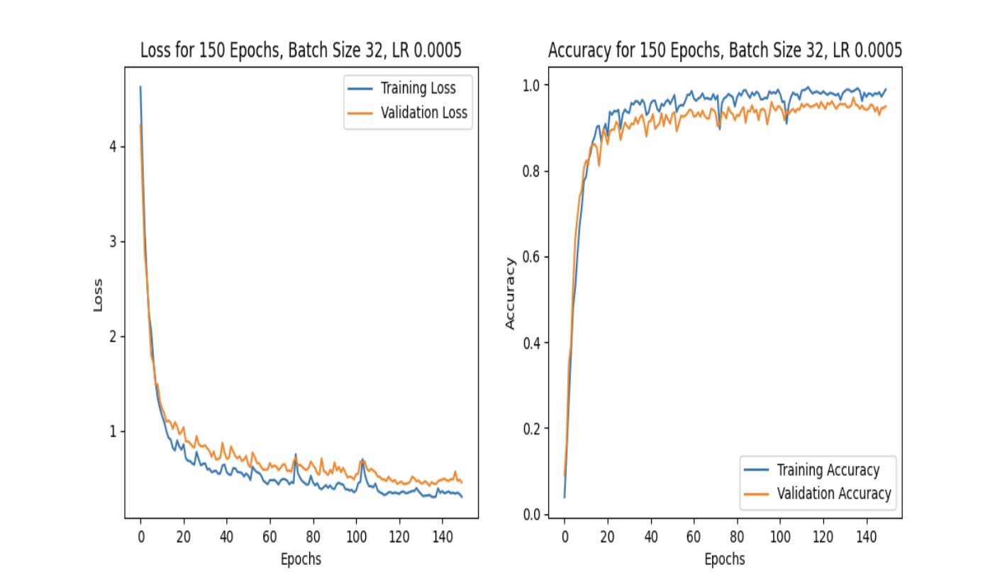
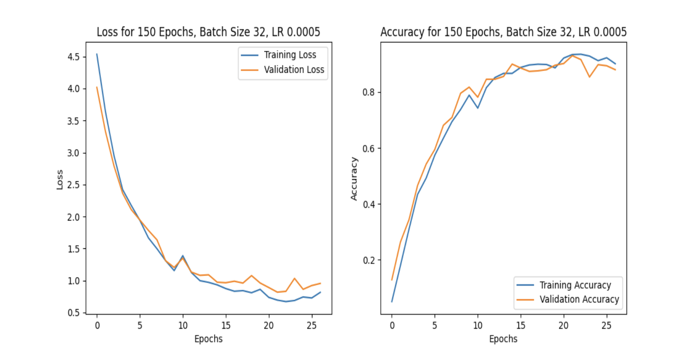

# Pill Image Classification (Baseline CNN with L2)

This repository contains **my individual contribution** to a team project.  
I was responsible for **model training, evaluation metric design, and iterative performance improvement**.  
Accordingly, this repo includes **only my part (training script)**; other team assets (data collection, preprocessing pipelines, deployment code, etc.) are **not included**.

The script trains a baseline CNN (with L2 regularization and dropout) for pill image classification.  
It loads images from directory structures (train/val/test), trains across combinations of epochs/batch size/learning rate, evaluates on a held-out test set, and saves:
1) the model graph (`.png`, once),  
2) training curves (`.png`),  
3) the trained model (`.keras`).  
 
**Reproducibility:** validation/test generators use `shuffle=False`. Filenames include hyperparameters and final test accuracy (`T_Acc`).

---

## 1. Project Structure

> This repository includes **only `main.py` (my part: training & evaluation)**.  
> The additional team scripts listed below are **not attached in this GitHub repo** (they belong to the broader team project).  
> The dataset is external and not committed.

```

.
├─ main.py                          # my contribution: training & evaluation script
├─ eval_predictor.py                (not attached in this repo)
├─ wrong_predictions_to_bin.py      (not attached in this repo)
├─ false_img_plotter.py             (not attached in this repo)
├─ requirements.txt                 # optional helper for reproduction
└─ data/                            # external, not committed
├─ train/
│  ├─ class_1/ img_*.jpg|png
│  └─ class_2/ ...
├─ val/
│  ├─ class_1/ ...
│  └─ class_2/ ...
└─ test/
├─ class_1/ ...
└─ class_2/ ...

```

### Expected Data Layout
The class name is inferred from the subfolder name:
```

data/
train/
CLASS_A/ *.jpg|png
CLASS_B/ *.jpg|png
val/
CLASS_A/ ...
CLASS_B/ ...
test/
CLASS_A/ ...
CLASS_B/ ...

````

---

## 2. Environment

- **OS/Hardware:** macOS (Apple Silicon **M3 Pro**)
- **IDE:** Work was done in **PyCharm** (open the project → run `main.py`)
- **Frameworks:** TensorFlow (Keras), Matplotlib
- **Note:** Saving the model diagram (`plot_model`) may require Graphviz/Pydot

---

## 3. How to Run

Edit the paths at the bottom of `main.py` (absolute paths are used by default), or place your data at those paths and run:

```bash
python main.py
````

What the script does:

* Loads images (`rescale=1/255`) via `ImageDataGenerator`.
* Builds a compact CNN with L2 regularization (conv/dense layers) and dropout.
* Trains with `EarlyStopping(monitor='val_loss', patience=5, restore_best_weights=True)`.
* Evaluates on the **test set**.
* Saves artifacts:

  * `{model_structure}.png` (model graph) — saved once
  * `{model_structure}_loss_accuracy_{...}_T_Acc_{test_accuracy:.4f}.png` (training curves)
  * `{model_structure}_{...}_T_Acc_{test_accuracy:.4f}.keras` (trained model)

---

## 4. Hyperparameters

Open `main.py` and modify:

```python
epochs_list = [150]
batch_sizes = [32]
initial_learning_rates = [0.0005]
model_structure = "new_added_dataset_ES_L2_Attention"  # filename prefix only
```

> You can provide multiple values (e.g., `epochs_list = [50, 150]`); the script iterates over **all combinations** of epochs × batch size × learning rate.

---

## 5. Tips (macOS M3 Pro)

* **Metal acceleration:** Confirm TensorFlow is using Metal:

  ```python
  import tensorflow as tf
  print(tf.config.list_physical_devices('GPU'))
  ```

  You should see at least one `GPU` device. If empty, re-check `tensorflow-macos`/`tensorflow-metal` installations.
* **Graphviz:** Required by `tensorflow.keras.utils.plot_model`. Install via your OS package manager if the model diagram fails to save.
* **Regularization:** L2 is also applied to the output layer. If convergence is slow, experiment with a smaller `l2(0.001)` or removing L2 on the final dense layer (for experiments only).

---

## 6. Citation

If you use this baseline or ideas from it, please cite this repository.

```
@software{pill_cnn_l2_baseline,
  title   = {Pill Image Classification: Baseline CNN with L2 Regularization},
  author  = {Sangmin Woo},
  year    = {2025},
  url     = {https://github.com/timidlione/MSc-Applicant/tree/main}
}
```

---

## 7. Results

### 7.1 Test Metrics (same held-out split, `shuffle=False`)
| Model Variant                                 | Test Loss | Test Accuracy |
|----------------------------------------------|-----------|---------------|
| CNN + L2 (150 epochs, no EarlyStopping)      | **0.4161** | **0.9589**    |
| CNN + L2 + EarlyStopping (patience=5)        | 0.7616    | 0.9177        |

<table>
  <tr>
    <th>Baseline – Metrics</th>
    <th>EarlyStopping – Metrics</th>
  </tr>
  <tr>
    <td align="center"></td>
    <td align="center"></td>
  </tr>
</table>

<table>
  <tr>
    <th>Baseline – Training Curves</th>
    <th>EarlyStopping – Training Curves</th>
  </tr>
  <tr>
    <td align="center"></td>
    <td align="center"></td>
  </tr>
</table>

**Interpretation.**
- Baseline: highest final accuracy; slight overfitting signs late in training.  
- EarlyStopping: earlier stop, smoother curves; slightly lower final accuracy depending on settings.  
- All evaluations use `shuffle=False` for reproducibility.
